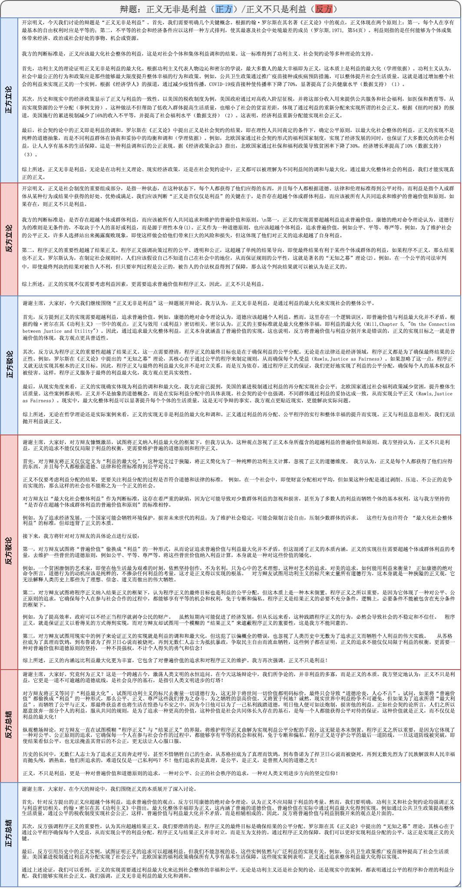
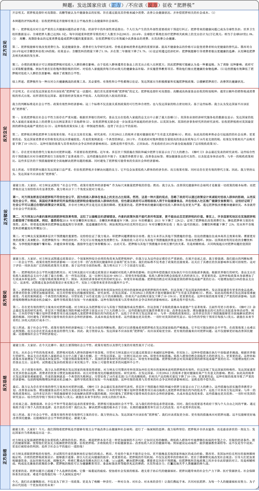

# Agent4Debate对局样例展示 (中文)

由于长度限制，我们删除了稿件中的参考文献部分。

## No.1 

     <em>Figure 1. 辩题：正义无非是利益/正义不只是利益。正方：Agent4Debate (GPT-4o), 反方: Agent4Debate (Claude-3.5-sonnet) </em>

## No.2

     <em>Figure 1. 辩题：发达国家应该/不应该征收肥胖税。正方：Agent4Debate (Gemini-1.5-Pro), 反方: Agent4Debate (Claude-3.5-sonnet) </em>

