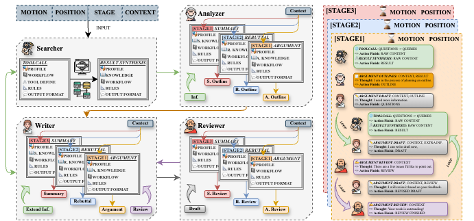
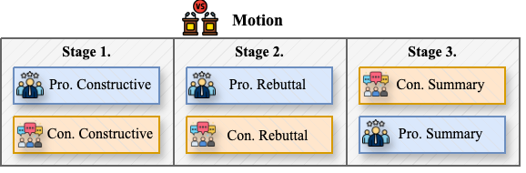
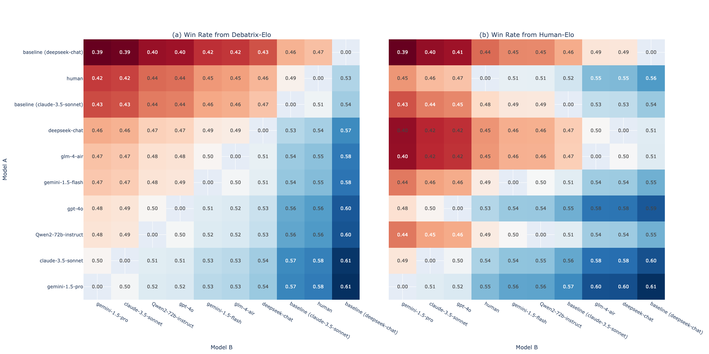

# Agent4Debate: Can LLMs Beat Humans in Debating? A Dynamic Multi-agent Framework for Competitive Debate

## Update

- **2024-08-09**: Ongoing work, coming soon.

## Overview of Agent4Debate

    Figure 1. The overview of Agent4Debate. A dynamic multi-agent framework based on LLMs designed to enhance their capabilities in competitive debate. Agent4Debate employs a collaborative architecture where four specialized agents, involving Searcher, Analyzer, Writer, and Reviewer, dynamically interact and cooperate. 

## Task Definition
Our debate structure comprises three distinct stages, namely *constructive arguments*, *rebuttals*, and *summary statements*.

     Figure 2. Competitive debate format.

## Elo Ranking

We collect records of 200 debate matches, covering 66 debate motions across three categories, including Fact, Value, and Policy. Participants included Agent4Debate using different foundation models, two baselines, and ten human debaters. Then, we calculate Elo scores for all 200 matches and sub-Elo scores for each of the three debate categories. 

### Debatrix-Elo Ranking

| Model               | Full    | Fact    | Policy  | Value   |
|---------------------|---------|---------|---------|---------|
| Gemini-1.5-Pro      | **1034.15** | 1154.93 | **1231.98** | 1075.30 |
| Claude-3.5-sonnet   | 1032.51 | **1159.18** | 1224.19 | 1074.33 |
| Qwen2-72b-Instruct  | 1023.31 | 1130.83 | 1179.62 | **1081.75** |
| GPT-4o              | 1022.21 | 1150.14 | 1137.49 | 1069.55 |
| Gemini-1.5-Flash    | 1012.45 | 1136.21 | 1156.50 | 1057.73 |
| GLM-4-Air           | 1011.72 | 1155.07 | 1148.53 | 1048.42 |
| Deepseek-chat       | 1004.00 | 1118.98 | 1131.16 | 1054.89 |
| Claude-3.5-sonnet*  | 982.07  | 479.50  | 956.21  | 1021.44 |
| Human               | 978.35  | 1109.73 | 515.57  | 953.05  |
| Deepseek-Chat*      | 954.34  | 491.13  | 478.78  | 983.99  |

<em>Table 3: Debatrix-Elo Ranking.</em>

### Human-Elo Ranking

| Model               | Full    | Fact    | Policy  | Value   |
|---------------------|---------|---------|---------|---------|
| Gemini-1.5-Pro      | **1040.64** | **1110.23** | **1104.79** | **1048.10** |
| Claude-3.5-sonnet   | 1031.15 | 1093.87 | 1104.44 | 1020.05 |
| GPT-4o              | 1028.84 | 1086.78 | 1099.63 | 1033.09 |
| Human               | 1006.46 | 1055.82 | 1030.32 | 1006.57 |
| Gemini-1.5-Flash    | 1000.00 | 1037.45 | 997.66  | 1003.29 |
| Qwen2-72b-Instruct  | 999.70  | 1041.10 | 976.16  | 1005.56 |
| Claude-3.5-sonnet*  | 991.38  | 1023.29 | 968.34  | 997.47  |
| GLM-4-Air           | 972.48  | 940.00  | 948.31  | 996.67  |
| Deepseek-chat       | 971.94  | 963.05  | 946.30  | 986.79  |
| Deepseek-Chat*      | 962.61  | 786.44  | 911.33  | 979.29  |

<em>
Table 4: Human-Elo Ranking.
</em>

<em>
     Figure 5. Predicted Win Rates Using Elo Rankings for Model A in A vs. B Battles.
</em>

### Case Study

(Due to length constraints, the references have been omitted. Translated from Chinese by Claude-3.5-sonnet. If you want to read the original Chinese version, pleas [click here](figures/case%20study/readme.md))

     <em>Figure 4. Case study of the debate motion "Justice is nothing but interest. (Pro side) / Justice is nothing more than interest (Con side)". Pro side is Agent4Debate (GPT-4o), Con side is Agent4Debate (Claude-3.5-sonnet). </em>

## Related Work
[AIDebater 2024](http://www.fudan-disc.com/sharedtask/AIDebater24/index.html)

[Debatrix: Multi-dimensional Debate Judge with Iterative Chronological Analysis Based on LLM](https://arxiv.org/abs/2403.08010)

[Chatbot Arena: New models & Elo system update](https://lmsys.org/blog/2023-12-07-leaderboard/)